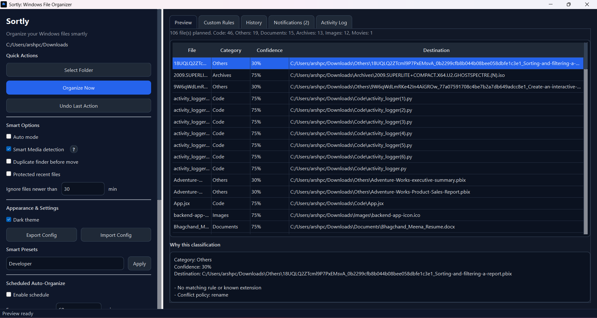
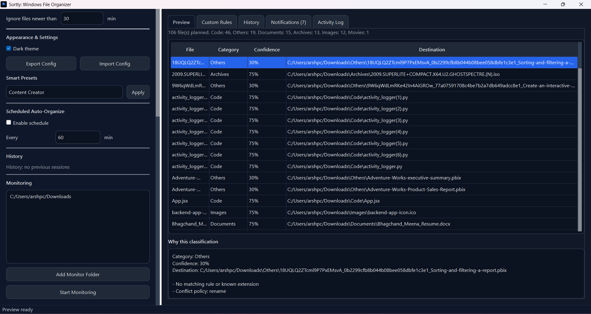
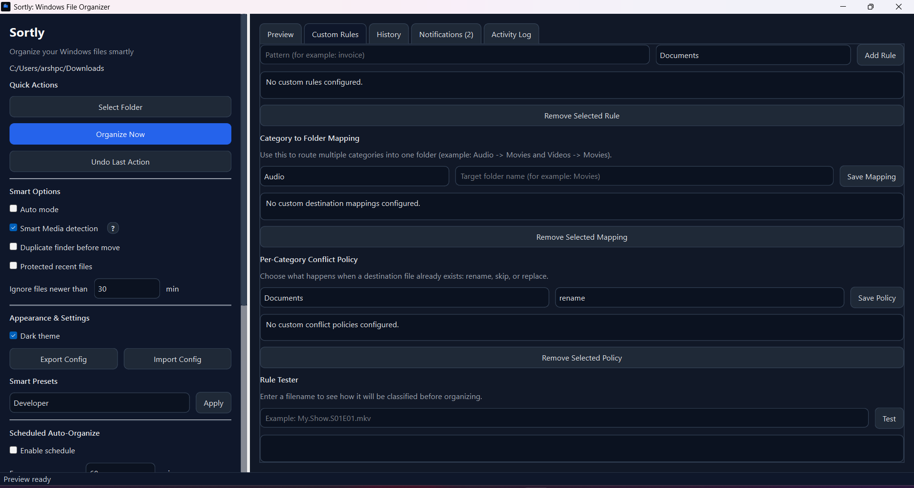
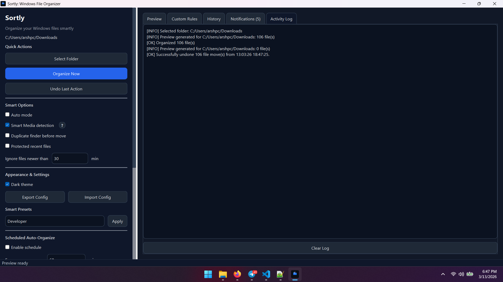

# Sortly — Full Documentation & User Guide

> **Version:** 1.0.0 &nbsp;|&nbsp; **Author:** Arsh Sisodiya &nbsp;|&nbsp; **Platform:** Windows 10 / 11

---

## Table of Contents

1. [Introduction](#1-introduction)
2. [Installation](#2-installation)
3. [Desktop App (GUI)](#3-desktop-app-gui)
   - 3.1 [Dashboard](#31-dashboard)
   - 3.2 [Monitoring](#32-monitoring)
   - 3.3 [Custom Rules](#33-custom-rules)
   - 3.4 [Activity Log](#34-activity-log)
   - 3.5 [Settings Panel](#35-settings-panel)
   - 3.6 [Undo History](#36-undo-history)
4. [CLI Reference](#4-cli-reference)
   - 4.1 [organize](#41-organize)
   - 4.2 [monitor](#42-monitor)
   - 4.3 [undo](#43-undo)
   - 4.4 [rules](#44-rules)
   - 4.5 [presets](#45-presets)
   - 4.6 [history](#46-history)
   - 4.7 [config](#47-config)
   - 4.8 [settings](#48-settings)
   - 4.9 [schedule](#49-schedule)
   - 4.10 [categories](#410-categories)
   - 4.11 [guide / help](#411-guide--help)
5. [Features In Depth](#5-features-in-depth)
   - 5.1 [File Categories](#51-file-categories)
   - 5.2 [Smart Media Detection](#52-smart-media-detection)
   - 5.3 [Duplicate Detection](#53-duplicate-detection)
   - 5.4 [Custom Rules](#54-custom-rules)
   - 5.5 [Smart Presets](#55-smart-presets)
   - 5.6 [Conflict Policies](#56-conflict-policies)
   - 5.7 [Protect Recent Files](#57-protect-recent-files)
   - 5.8 [Scheduling](#58-scheduling)
   - 5.9 [Windows Autostart](#59-windows-autostart)
   - 5.10 [Undo System](#510-undo-system)
   - 5.11 [Config Export / Import](#511-config-export--import)
6. [Settings Reference](#6-settings-reference)
7. [Build & Distribution](#7-build--distribution)
8. [CI / CD](#8-ci--cd)
9. [Data Files & Paths](#9-data-files--paths)
10. [Troubleshooting](#10-troubleshooting)

---

## 1. Introduction

Sortly is a Windows file organizer that automatically sorts files in any folder into
categorized sub-folders. It works on a plan-then-execute model: it always shows you
exactly what it intends to do before moving anything.

**Two interfaces, same engine:**

| Interface | Use when |
|---|---|
| Desktop App (`sortly_gui_qt.py`) | Day-to-day use, visual feedback, settings UI |
| CLI (`sortly_cli.py`) | Scripting, automation, CI pipelines, headless servers |

Both interfaces share the same `sortly/core.py` engine and the same settings file.

---

## 2. Installation

### From source

```bash
git clone https://github.com/your-username/sortly.git
cd sortly
pip install -r requirements.txt
```

**requirements.txt** installs:

| Package | Purpose |
|---|---|
| `PySide6` | Qt6 GUI framework |
| `watchdog` | Filesystem monitoring |
| `pymediainfo` | Smart movie/series detection |

### From installer

Download `SortlySetup-x.y.z.exe` from the [Releases](https://github.com/your-username/sortly/releases) page and run it. The installer places `Sortly.exe` in `Program Files\Sortly` and adds a Start Menu shortcut.

### Portable exe

Download `sortly-cli.exe` from Releases for a standalone CLI — no installer, no Python required.

---

## 3. Desktop App (GUI)

Launch with:

```bash
python sortly_gui_qt.py
```

Or run `Sortly.exe` from the installation directory.

---

### 3.1 Dashboard



The dashboard is the main view. From here you can:

- **Add folders** — click *Add Folder* or drag and drop directories onto the window
- **Preview** — click *Preview* to build an organization plan without moving any files. The plan shows each file's proposed destination, category, confidence score, and the reasons behind the classification.
- **Organize** — click *Organize Now* to execute the plan. Files are moved and a history record is saved.
- **Summary panel** — shows how many files will move into each category, and how many are skipped and why.

The dashboard respects all active settings (duplicate detection, recent-file protection, custom rules, smart media detection, etc.) when building the preview.

---

### 3.2 Monitoring



Real-time monitoring watches folders using the OS filesystem event API (via `watchdog`). When a new file appears in a watched folder, Sortly automatically organizes it after a 1.5-second debounce period (to avoid acting on partially-written files).

**To start monitoring:**

1. Add folders in the monitoring tab
2. Click *Start Monitoring*
3. The status indicator turns green and the log shows incoming events

**Save monitored folders:** toggle the *Save* switch before starting. Sortly persists the folder list in settings. On the next launch, or after a system restart with autostart enabled, monitoring resumes automatically.

**Windows Autostart:** when monitoring is enabled, Sortly writes itself into the Windows registry (`HKCU\Software\Microsoft\Windows\CurrentVersion\Run`) so it launches silently on login and restores monitoring. When you stop monitoring via the Stop button, the autostart entry is removed.

---

### 3.3 Custom Rules



Custom rules let you override the extension-based classifier with substring matching on the filename. Rules are evaluated first, before extension and smart media detection.

**Adding a rule:**

- Enter a substring (e.g. `invoice`) and select a target category (e.g. `Documents`)
- Click *Add Rule*

**Rule matching:**

- Case-insensitive substring match against the full filename
- First matching rule wins
- If no rule matches, the extension-based classifier runs

**Testing a rule:**

Use the *Test Rule* field — type a filename and the panel shows which rule would match and into which category the file would be classified.

---

### 3.4 Activity Log



The activity log shows a timestamped list of all operations Sortly has performed in the current and past sessions. Log entries include:

- Files moved (source → destination)
- Monitoring start / stop events
- Errors and warnings
- Autostart sync events

The log is also written to `%USERPROFILE%\.sortly\activity.log` as plain text.

---

### 3.5 Settings Panel

The settings panel exposes all configuration options in a visual form:

| Setting | Description |
|---|---|
| Smart Media Detection | Detect movies and web series from video files using filename patterns and PyMediaInfo |
| Duplicate Detection | Group files with identical SHA-256 hash into a `Duplicates` folder |
| Protect Recent Files | Skip files modified within the configured time window |
| Recency Window | Minutes — files newer than this are protected |
| Auto Mode | Execute immediately without preview confirmation |
| Category Folder Map | Override the destination folder name for any category |
| Conflict Policy | Per-category: `rename` (add suffix), `skip`, or `replace` |
| Excluded Extensions | Extensions that Sortly will never touch |
| Excluded Folders | Folder names treated as already-organized (never re-organized) |

---

### 3.6 Undo History

Sortly records every file move in `%USERPROFILE%\.sortly\history.json`. The Undo panel shows a list of past sessions. Select a session to see every file that was moved in that session, then:

- **Preview Undo** — see exactly what would be restored before committing
- **Undo** — restore all files in that session to their original locations

Undo only works if the destination files still exist in the locations Sortly moved them to. Files that have been moved or deleted since will be reported as missing in the preview.

---

## 4. CLI Reference

Launch the CLI:

```bash
# From source
python sortly_cli.py [command] [options]

# Installed CLI
sortly-cli.exe [command] [options]
```

Global help:

```bash
python sortly_cli.py --help
python sortly_cli.py help
```

---

### 4.1 organize

Scan a folder and organize files into sub-folders.

```bash
python sortly_cli.py organize <PATH> [OPTIONS]
```

**Options:**

| Flag | Description |
|---|---|
| `--dry-run` | Build the plan but do not move any files (default behavior when no flag given and auto_mode is off) |
| `--auto` | Execute immediately, skip the confirmation prompt |
| `--details` | Show confidence score, destination folder, and classification reasons for each file |
| `--show-skipped` | Print the list of skipped files and the reason each was skipped |
| `--no-preview` | Suppress the per-file table, show only the summary |
| `--limit N` | Limit number of rows shown in the preview table (default: 50) |
| `--no-color` | Disable ANSI color codes (useful for log files or CI) |

**Examples:**

```bash
# Review what will happen before touching anything
python sortly_cli.py organize "C:\Users\You\Downloads" --dry-run --details

# Show skipped files as well
python sortly_cli.py organize "C:\Users\You\Downloads" --dry-run --details --show-skipped

# Execute without prompts (good for scripts)
python sortly_cli.py organize "C:\Users\You\Downloads" --auto

# Only show the summary, not the full per-file list
python sortly_cli.py organize "C:\Users\You\Downloads" --no-preview --auto

# Limit the preview to the first 20 files
python sortly_cli.py organize "C:\Users\You\Downloads" --limit 20
```

**Exit codes:**

| Code | Meaning |
|---|---|
| 0 | Success |
| 1 | Error (invalid path, permission denied, etc.) |
| 2 | Aborted by user at confirmation prompt |

---

### 4.2 monitor

Watch one or more folders and auto-organize new files as they arrive.

```bash
python sortly_cli.py monitor <PATH1> [PATH2 ...] [OPTIONS]
```

**Options:**

| Flag | Description |
|---|---|
| `--save` | Save these folders as the persistent monitored set in settings |
| `--use-saved` | Use the folder list saved in settings instead of providing paths |
| `--no-color` | Disable color output |

**Examples:**

```bash
# Monitor Downloads in real-time (Ctrl+C to stop)
python sortly_cli.py monitor "C:\Users\You\Downloads"

# Monitor multiple folders and save them
python sortly_cli.py monitor "C:\Users\You\Downloads" "C:\Users\You\Desktop" --save

# Reuse saved folders
python sortly_cli.py monitor --use-saved
```

**Behavior:**

- A 1.5-second debounce avoids processing partially-written files
- Each organized file is logged to the activity log
- Monitoring runs until `Ctrl+C`; the process exits cleanly on interrupt

---

### 4.3 undo

Revert file moves from a past session.

```bash
python sortly_cli.py undo [OPTIONS]
```

**Options:**

| Flag | Description |
|---|---|
| `--preview` | Show what would be restored without doing it (default if neither flag given) |
| `--yes` | Execute the undo immediately without a confirmation prompt |
| `--session N` | Undo session number N from history (default: latest session) |

**Examples:**

```bash
# Preview what the latest undo would restore
python sortly_cli.py undo --preview

# Undo the latest session
python sortly_cli.py undo --yes

# Undo a specific session (list sessions first)
python sortly_cli.py history list
python sortly_cli.py undo --session 3 --yes
```

---

### 4.4 rules

Manage and test custom classification rules.

```bash
python sortly_cli.py rules <subcommand> [OPTIONS]
```

**Subcommands:**

| Subcommand | Description |
|---|---|
| `list` | Print all current rules with their index numbers |
| `add <PATTERN> <CATEGORY>` | Add a new substring rule |
| `remove <INDEX>` | Remove rule by its index number (use `list` to find it) |
| `test <FILENAME>` | Test how a filename would be classified |

**Examples:**

```bash
# See all rules
python sortly_cli.py rules list

# Add a rule: filenames containing "invoice" go to Documents
python sortly_cli.py rules add invoice Documents

# Add a rule: filenames containing "budget" go to Documents
python sortly_cli.py rules add budget Documents

# Remove rule #2
python sortly_cli.py rules remove 2

# Test classification of a filename
python sortly_cli.py rules test "show.s01e01.mkv"
python sortly_cli.py rules test "Q3_invoice_2026.pdf"
```

**Valid category names:**

`Images`, `Videos`, `Movies`, `WebSeries`, `Audio`, `Documents`, `Archives`, `Code`, `Executables`, `Fonts`, `Duplicates`, `Others`

---

### 4.5 presets

Apply curated settings bundles.

```bash
python sortly_cli.py presets <subcommand>
```

**Subcommands:**

| Subcommand | Description |
|---|---|
| `list` | Print available preset names |
| `show <NAME>` | Print all settings that a preset would apply |
| `apply <NAME>` | Apply the preset, updating settings immediately |

**Built-in presets:**

| Preset | Optimized for |
|---|---|
| `Developer` | Code projects — prioritizes Code and Archives categories |
| `Student` | Study folders — prioritizes Documents and Images |
| `Content Creator` | Media production — prioritizes Images, Videos, Audio |
| `Office Work` | Business — prioritizes Documents, Archives |

**Examples:**

```bash
python sortly_cli.py presets list
python sortly_cli.py presets show Developer
python sortly_cli.py presets apply Developer
```

---

### 4.6 history

Inspect the session history.

```bash
python sortly_cli.py history <subcommand>
```

**Subcommands:**

| Subcommand | Description |
|---|---|
| `list` | List recent sessions with session index, timestamp, and file count |
| `show <INDEX>` | Print full details of a session (every file that was moved) |

**Examples:**

```bash
# See the last 10 sessions
python sortly_cli.py history list

# Drill into session 2
python sortly_cli.py history show 2
```

---

### 4.7 config

Export or import the full settings bundle.

```bash
python sortly_cli.py config <subcommand>
```

**Subcommands:**

| Subcommand | Description |
|---|---|
| `show` | Print the active config as formatted JSON |
| `export <FILE>` | Write the full settings to a JSON file |
| `import <FILE>` | Load settings from a JSON file, replacing current settings |

**Examples:**

```bash
# View current config
python sortly_cli.py config show

# Back up settings
python sortly_cli.py config export sortly-backup.json

# Restore settings
python sortly_cli.py config import sortly-backup.json

# Copy settings between machines
# 1. On machine A:
python sortly_cli.py config export sortly-config.json
# 2. Copy sortly-config.json to machine B, then:
python sortly_cli.py config import sortly-config.json
```

---

### 4.8 settings

Read and write individual settings keys.

```bash
python sortly_cli.py settings <subcommand>
```

**Subcommands:**

| Subcommand | Description |
|---|---|
| `show` | Print all settings with descriptions |
| `get <KEY>` | Print the current value of one key |
| `set <KEY> <VALUE>` | Update one key |

**Examples:**

```bash
# Show all settings
python sortly_cli.py settings show

# Read a single value
python sortly_cli.py settings get enable_duplicate_detection
python sortly_cli.py settings get protect_recent_minutes

# Toggle booleans
python sortly_cli.py settings set enable_duplicate_detection true
python sortly_cli.py settings set protect_recent_files true
python sortly_cli.py settings set protect_recent_minutes 60

# Update a list value (JSON syntax)
python sortly_cli.py settings set excluded_extensions "[".tmp", ".bak", ".log"]"

# Update a dict value (JSON syntax)
python sortly_cli.py settings set category_folder_map "{\"Audio\": \"Music\", \"Videos\": \"Media\"}"

# Update conflict policy per category
python sortly_cli.py settings set category_conflict_policy "{\"Documents\": \"skip\", \"Images\": \"rename\"}"
```

---

### 4.9 schedule

Configure and run scheduled organize cycles.

```bash
python sortly_cli.py schedule <subcommand>
```

**Subcommands:**

| Subcommand | Description |
|---|---|
| `show` | Print current schedule settings |
| `set` | Update schedule settings |
| `run <PATH>` | Run repeated organize cycles on a folder |

**`set` options:**

| Flag | Description |
|---|---|
| `--enabled true/false` | Enable or disable scheduled runs |
| `--interval N` | Minutes between runs |

**`run` options:**

| Flag | Description |
|---|---|
| `--interval N` | Override interval for this session (minutes) |
| `--iterations N` | Stop after N cycles (default: run forever) |
| `--dry-run` | Preview only — do not actually move files |

**Examples:**

```bash
# View current schedule settings
python sortly_cli.py schedule show

# Enable scheduling with 30-minute interval
python sortly_cli.py schedule set --enabled true --interval 30

# Run 3 organize cycles on Downloads, 10 minutes apart
python sortly_cli.py schedule run "C:\Users\You\Downloads" --interval 10 --iterations 3

# Test one dry-run cycle
python sortly_cli.py schedule run "C:\Users\You\Downloads" --iterations 1 --dry-run
```

---

### 4.10 categories

List all categories and their file extensions.

```bash
python sortly_cli.py categories
```

Prints the full list of categories with their associated extensions and icons.

---

### 4.11 guide / help

```bash
# Full banner + command list
python sortly_cli.py help

# Topic guides
python sortly_cli.py guide overview
python sortly_cli.py guide organize
python sortly_cli.py guide rules
python sortly_cli.py guide presets
python sortly_cli.py guide history
python sortly_cli.py guide config
python sortly_cli.py guide settings
python sortly_cli.py guide monitor
python sortly_cli.py guide schedule
```

---

## 5. Features In Depth

### 5.1 File Categories

Sortly classifies files by their extension. The classification pipeline runs in this order:

1. **Custom rules** — substring match on filename (highest priority)
2. **Duplicate detection** — if enabled, SHA-256 hash match routes to `Duplicates`
3. **Smart media detection** — if enabled, video files may be promoted to `Movies` or `WebSeries`
4. **Extension mapping** — standard extension → category lookup
5. **Fallback** — `Others`

Each classification includes a confidence score (0–100) and a list of reasons that explain the decision.

---

### 5.2 Smart Media Detection

When enabled (`enable_smart_media_detection = true`), Sortly applies extra logic to `.mp4`, `.mkv`, `.avi`, and other video extensions:

**Web Series detection (regex patterns):**

Files matching episode naming conventions are routed to `WebSeries`:
- `S01E01`, `s02e05` — standard SxxExx
- `1x01`, `2x12` — NxNN format
- `[01]`, `[102]` — bracketed episode numbers

**Movie detection (PyMediaInfo):**

If `pymediainfo` is installed and `MediaInfo.dll` is available, Sortly reads actual video metadata. Files with a runtime > 45 minutes that don't match episode patterns are classified as `Movies`.

If PyMediaInfo is unavailable, the classifier falls back to filename heuristics (year patterns like `(2023)`, quality markers like `BluRay`, `1080p`, etc.).

---

### 5.3 Duplicate Detection

When enabled (`enable_duplicate_detection = true`):

1. Sortly computes the SHA-256 hash of every file in the scan
2. Files with matching hashes are grouped as duplicates
3. The first file in each group stays in its category; all others move to a `Duplicates` folder

This is intentionally conservative: only exact byte-for-byte duplicates are detected.

---

### 5.4 Custom Rules

Custom rules are stored in settings as a list of `{"pattern": ..., "category": ...}` objects.

- Matching is **case-insensitive substring** — `"invoice"` matches `Q3_Invoice_2026.pdf`
- Rules are evaluated in list order — first match wins
- Rules take priority over all other classification logic
- Rules survive config export/import

---

### 5.5 Smart Presets

Presets are bundled settings patches defined in `sortly/smart_presets.py`. They update multiple settings atomically. After applying a preset you can still fine-tune individual settings.

| Preset | What it changes |
|---|---|
| Developer | Prioritizes Code; enables smart media detection off; maps Archives separately |
| Student | Enables duplicate detection; prioritizes Documents and Images |
| Content Creator | Enables smart media detection; prioritizes Images, Videos, Audio |
| Office Work | Enables duplicate detection; prioritizes Documents; strict conflict policies |

---

### 5.6 Conflict Policies

When a file with the same name already exists in the destination folder, Sortly applies the conflict policy for that category:

| Policy | Behavior |
|---|---|
| `rename` (default) | Adds a numeric suffix: `file (1).txt`, `file (2).txt` |
| `skip` | Leaves the source file untouched; logs a skip |
| `replace` | Overwrites the existing destination file |

Set per-category from the GUI or via:

```bash
python sortly_cli.py settings set category_conflict_policy "{\"Documents\": \"skip\"}"
```

---

### 5.7 Protect Recent Files

When enabled, files modified within the configured time window are skipped entirely.

```bash
python sortly_cli.py settings set protect_recent_files true
python sortly_cli.py settings set protect_recent_minutes 60
```

This is useful when monitoring active working folders — you don't want a file you're currently editing to be moved mid-work.

---

### 5.8 Scheduling

The schedule system runs `organize` on a folder repeatedly at a set interval.

```bash
# Save schedule settings
python sortly_cli.py schedule set --enabled true --interval 15

# Start a scheduled session on Downloads
python sortly_cli.py schedule run "C:\Users\You\Downloads"
```

Unlike monitoring (which reacts to filesystem events), scheduling is purely time-based — it re-scans the entire folder on each tick.

---

### 5.9 Windows Autostart

When folder monitoring is started through the GUI, Sortly writes the following registry entry:

```
HKCU\Software\Microsoft\Windows\CurrentVersion\Run
  SortlyFileOrganizer = "C:\...\Sortly.exe"
```

On the next login, `Sortly.exe` launches minimized to the system tray and immediately restores monitoring on the saved folder list.

When monitoring is stopped via the *Stop Monitoring* button, the registry entry is removed and autostart is disabled.

This does not require administrator rights — it uses `HKCU` (current user only).

---

### 5.10 Undo System

Every organize session writes a JSON record to `%USERPROFILE%\.sortly\history.json` with:

- Session timestamp
- List of `{source, destination, timestamp}` move records

**Undo restores files by:**

1. Reading the move records for the selected session
2. Checking that the destination file still exists
3. Moving each file back to its original source path
4. Removing empty destination folders if they are now empty

**Undo is not available for:**

- Files deleted after the organize ran
- Files moved again by a subsequent organize session (the path no longer matches)

---

### 5.11 Config Export / Import

Sortly stores all settings in a single JSON file. You can export it, edit it manually, or import it on another machine.

```bash
python sortly_cli.py config export sortly-config.json
```

The exported file contains every setting key and value. You can edit it in any text editor. To apply it:

```bash
python sortly_cli.py config import sortly-config.json
```

The GUI has equivalent *Export Config* and *Import Config* buttons in the settings panel.

---

## 6. Settings Reference

All settings live in `%USERPROFILE%\.sortly\settings.json`.

| Key | Type | Default | Description |
|---|---|---|---|
| `auto_mode` | bool | `false` | Skip preview and execute immediately |
| `schedule_enabled` | bool | `false` | Enable scheduled organize runs |
| `schedule_interval_minutes` | int | `15` | Minutes between scheduled runs |
| `enable_duplicate_detection` | bool | `false` | SHA-256 duplicate grouping |
| `protect_recent_files` | bool | `false` | Skip recently modified files |
| `protect_recent_minutes` | int | `30` | Recency window in minutes |
| `monitor_enabled` | bool | `false` | Whether monitoring is the active startup mode |
| `enable_smart_media_detection` | bool | `true` | Promote videos to Movies/WebSeries |
| `monitored_folders` | list | `[]` | Saved folder list for monitoring |
| `custom_rules` | list | `[]` | `[{"pattern": "...", "category": "..."}]` |
| `category_folder_map` | dict | `{}` | `{"Audio": "Music"}` — renames destination folder |
| `category_conflict_policy` | dict | `{}` | `{"Documents": "skip"}` — per-category conflict handling |
| `excluded_extensions` | list | `[]` | Extensions to completely ignore |
| `excluded_folders` | list | `[]` | Folder names treated as destinations (never re-organized) |
| `log_file` | str | `activity.log` | Log filename inside `.sortly/` |
| `history_file` | str | `history.json` | History filename inside `.sortly/` |

---

## 7. Build & Distribution

### Requirements

- Python 3.11+
- `pip install pyinstaller`
- [Inno Setup 6](https://jrsoftware.org/isinfo.php) (only needed for installer step)
- [UPX](https://upx.github.io/) (optional; auto-downloaded if not found)

### Build everything

```bash
python build_executables.py
```

**What this does:**

1. Cleans `dist/` and `build/`
2. Auto-detects or downloads UPX for compression
3. Builds `dist/sortly-cli.exe` — portable CLI (PyInstaller `--onefile`)
4. Builds `dist/Sortly/` — GUI onedir bundle (PyInstaller `--onedir`)
5. Strips unused Qt DLLs from the onedir bundle
6. Compiles `dist/SortlySetup-x.y.z.exe` using Inno Setup (if ISCC.exe found)

### Build CLI only

```bash
python build_executables.py --skip-installer
```

### Installer only (after PyInstaller step)

```bash
"C:\Program Files (x86)\Inno Setup 6\ISCC.exe" /DMyAppVersion=1.0.0 installer\sortly.iss
```

### Output files

| File | Description |
|---|---|
| `dist/sortly-cli.exe` | Portable single-file CLI — no install needed |
| `dist/Sortly/Sortly.exe` | GUI app (onedir — run from the folder) |
| `dist/SortlySetup-1.0.0.exe` | Windows installer with Start Menu shortcuts and uninstaller |

---

## 8. CI / CD

The GitHub Actions workflow in `.github/workflows/release.yml` triggers on any tag matching `v*`.

### Releasing a new version

1. Update `__version__` in `sortly/__init__.py`
2. Commit and push
3. Tag the release:

```bash
git tag v1.1.0
git push origin v1.1.0
```

The workflow:

1. Sets up Python 3.11 on `windows-latest`
2. Installs dependencies and PyInstaller
3. Installs UPX via Chocolatey
4. Sets `APP_VERSION` from the tag
5. Runs `python build_executables.py --skip-installer`
6. Installs Inno Setup via Chocolatey
7. Compiles the installer with ISCC
8. Creates a GitHub Release with `SortlySetup-x.y.z.exe` and `sortly-cli.exe` as assets

**Pre-releases:** tags with a hyphen (e.g. `v1.1.0-beta.1`) are automatically published as pre-releases.

---

## 9. Data Files & Paths

All user data is stored in `%USERPROFILE%\.sortly\` (e.g. `C:\Users\YourName\.sortly\`):

| File | Purpose |
|---|---|
| `settings.json` | All configuration |
| `history.json` | File move history for undo |
| `activity.log` | Timestamped operation log (plain text) |

None of these files are touched by uninstalling the app. To fully reset Sortly, delete the `.sortly` folder.

---

## 10. Troubleshooting

### App doesn't start / crashes immediately

- Run from a terminal to see the error:
  ```bash
  python sortly_gui_qt.py
  ```
- Make sure all dependencies are installed:
  ```bash
  pip install -r requirements.txt
  ```

### "PyMediaInfo not available" warning

Sortly still works without it — smart movie detection falls back to filename heuristics. To enable full media detection, install `pymediainfo`:

```bash
pip install pymediainfo
```

On Windows, `pymediainfo` bundles `MediaInfo.dll` automatically.

### Monitoring stops after a while

Windows may suspend the process if it's idle for too long. Run Sortly as a standard foreground app, or use the Windows Task Scheduler to restart it on a schedule.

### Files not being moved despite matching extensions

Check whether:

1. The file was recently modified and `protect_recent_files` is on
2. A conflict policy is set to `skip` for that category
3. The file's extension is in `excluded_extensions`
4. The file is inside a folder listed in `excluded_folders`

```bash
# Check each of these
python sortly_cli.py settings get protect_recent_files
python sortly_cli.py settings get excluded_extensions
python sortly_cli.py settings get category_conflict_policy
```

### Undo says "file not found"

The file was moved or deleted after Sortly organized it. Undo can only restore files that still exist at the destination path recorded in history.

### The installer build fails

- Confirm Inno Setup 6 is installed at `C:\Program Files (x86)\Inno Setup 6\`
- Run the PyInstaller step first to populate `dist/Sortly/`
- Check the Inno Setup log for the specific compile error

### CLI shows garbled characters

The Windows terminal uses cp1252 by default, which doesn't support Unicode box-drawing characters. Set UTF-8 mode:

```powershell
$env:PYTHONUTF8 = "1"
python sortly_cli.py ...
```

Or:

```powershell
chcp 65001
python sortly_cli.py ...
```

---

*Sortly — Built by Arsh Sisodiya*
