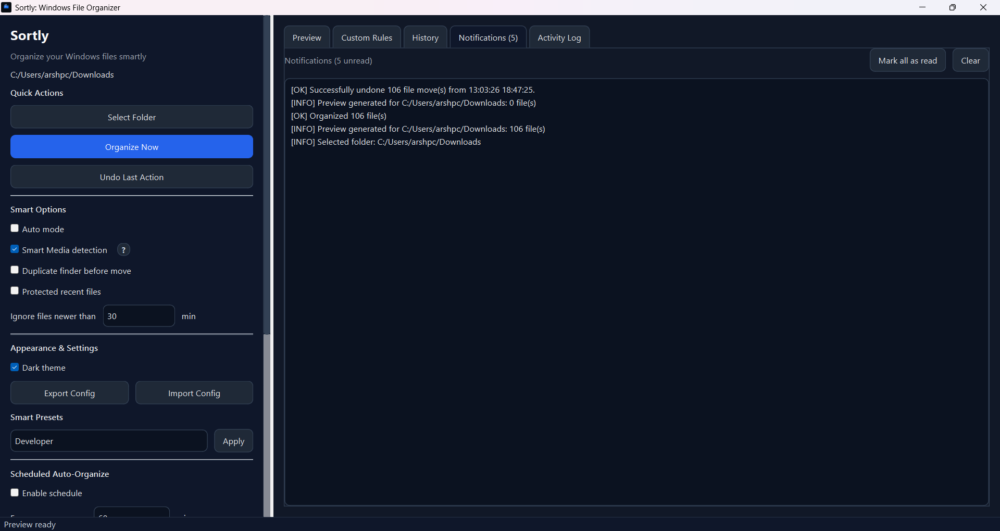

<div align="center">
  
  <h1>Sortly</h1>
  <p><strong>Smart Windows File Organizer</strong></p>
  <p>
    
    
    
    
  </p>
</div>

---

Sortly automatically organizes files into categories like Documents, Images, Videos, Audio, Code, and more — with a modern native Qt desktop app and a full-featured CLI. It supports real-time folder monitoring, custom rules, smart media detection, duplicate grouping, undo, scheduling, and Windows autostart.

## Screenshots

| Dashboard | Monitoring | Custom Rules |
|:---------:|:----------:|:------------:|
|  |  |  |

| Activity Log | Notifications |
|:------------:|:-------------:|
|  |  |

---

## Features

- **One-click organization** — scan any folder and preview exactly what will move before committing
- **Real-time monitoring** — watch folders and auto-organize new files as they arrive
- **Windows autostart** — when monitoring is enabled, Sortly registers itself to start with Windows
- **Smart media detection** — separates web series (`S01E01` patterns) from movies automatically
- **Duplicate detection** — SHA-256 hash grouping, isolates copies into a `Duplicates` folder
- **Custom rules** — map filename substrings to any category, evaluated before extension matching
- **Smart presets** — apply curated setting bundles for Developer, Student, Content Creator, or Office
- **Conflict policies** — per-category control: rename (default), skip, or replace on filename collision
- **Protect recent files** — skip files modified within a configurable time window
- **Undo** — full session history with per-file undo preview before restoring anything
- **Scheduling** — configure auto-organize to run every N minutes
- **Config import / export** — share or back up your full settings as a single JSON file
- **CLI parity** — every feature available from both the GUI and the command line

---

## Quick Start

### Requirements

- Windows 10 / 11 (64-bit)
- Python 3.11+

### Install from source

```bash
git clone https://github.com/your-username/sortly.git
cd sortly
pip install -r requirements.txt
```

### Run the desktop app

```bash
python sortly_gui_qt.py
```

### Run the CLI

```bash
python sortly_cli.py --help
```

### Build installers

```bash
python build_executables.py
```

Produces `dist/Sortly/Sortly.exe` (GUI), `dist/sortly-cli.exe` (CLI), and `dist/SortlySetup-1.0.0.exe` (Windows installer, requires [Inno Setup 6](https://jrsoftware.org/isinfo.php)).
Also builds `dist/SortlyPortable.exe` for a no-install portable GUI build.

---

## CLI Quick Reference

```bash
# Organize a folder (dry-run preview)
python sortly_cli.py organize "C:\Users\You\Downloads" --dry-run --details

# Organize immediately without prompts
python sortly_cli.py organize "C:\Users\You\Downloads" --auto

# Monitor folders in real-time (Ctrl+C to stop)
python sortly_cli.py monitor "C:\Users\You\Downloads" --save

# Undo the last session
python sortly_cli.py undo --yes

# Add a custom rule
python sortly_cli.py rules add invoice Documents

# Apply a smart preset
python sortly_cli.py presets apply Developer

# Show all settings
python sortly_cli.py settings show

# Export config
python sortly_cli.py config export my-settings.json
```

> See [DOCS.md](DOCS.md) for complete CLI reference and detailed guides.

---

## Categories

| Category | Extensions (examples) |
|---|---|
| Images | `.jpg` `.png` `.gif` `.svg` `.webp` `.heic` `.raw` `.psd` |
| Videos | `.mp4` `.mkv` `.avi` `.mov` `.webm` `.ts` |
| Movies | Detected from Videos via smart media detection |
| WebSeries | Detected from Videos via S01E01 pattern matching |
| Audio | `.mp3` `.flac` `.wav` `.aac` `.ogg` `.m4a` |
| Documents | `.pdf` `.docx` `.xlsx` `.pptx` `.txt` `.csv` `.md` |
| Archives | `.zip` `.rar` `.7z` `.tar.gz` `.iso` |
| Code | `.py` `.js` `.ts` `.html` `.css` `.java` `.go` `.rs` |
| Executables | `.exe` `.msi` `.apk` `.jar` |
| Fonts | `.ttf` `.otf` `.woff` `.woff2` |
| Duplicates | Files with identical SHA-256 hash |
| Others | Everything else |

---

## Package Layout

```text
sortly/
|- assets/
|  |- screenshots/          screenshots used in README
|  |- sortly_logos/         ICO, PNG, SVG logo assets
|- sortly/                  Python package
|  |- __init__.py
|  |- core.py               Engine: organizer, settings, history, monitoring
|  |- gui_qt.py             PySide6 Qt desktop application
|  |- cli.py                Full-featured CLI
|  |- movie_detector.py     PyMediaInfo-based movie/series classifier
|  |- duplicate_detector.py SHA-256 duplicate finder
|  |- smart_presets.py      Preset bundles (Developer, Student, etc.)
|- installer/
|  |- sortly.iss            Inno Setup 6 installer script
|- .github/
|  |- workflows/
|     |- release.yml        GitHub Actions: build + release on version tags
|- sortly_gui_qt.py         GUI entrypoint
|- sortly_cli.py            CLI entrypoint
|- build_executables.py     PyInstaller + Inno Setup build script
|- requirements.txt
|- README.md
|- DOCS.md                  Full documentation and CLI reference
```

---

## Data / Config Paths

Sortly stores all user data in `%USERPROFILE%\.sortly\`:

| File | Purpose |
|---|---|
| `settings.json` | All app settings |
| `history.json` | Move history for undo |
| `activity.log` | Timestamped activity log |

---

## GitHub Release (CI)

Push a version tag to trigger an automatic build and release:

```bash
git tag v1.0.0
git push origin v1.0.0
```

The GitHub Actions workflow builds `SortlySetup-1.0.0.exe`, `SortlyPortable.exe`, and `sortly-cli.exe`, then creates a GitHub Release with all three as downloadable assets.

---

## License

MIT — Copyright © 2026 Arsh Sisodiya
